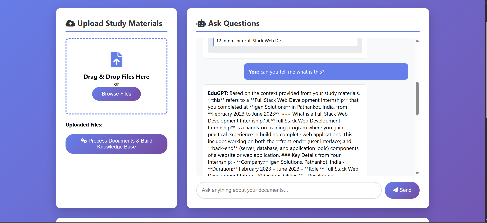
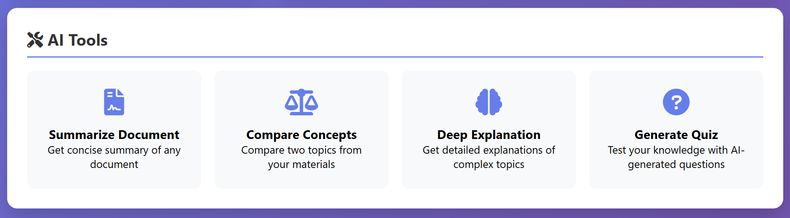
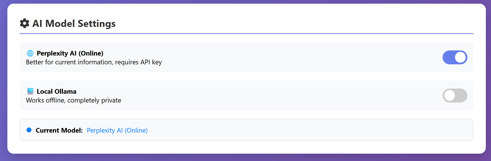

<table>
  <tr>
    <td align="center">
      
      <br />
      <b>Home Page</b>
    </td>
    <td align="center">
      
      <br />
      <b>Chat Window</b>
    </td>
  </tr>
  <tr>
    <td align="center">
      
      <br />
      <b>Source View</b>
    </td>
  </tr>
</table>
# 🎓 EduGPT: AI Study Assistant & RAG System

**EduGPT** is an intelligent study companion designed to help students and researchers interact with their learning materials. Built on a Retrieval-Augmented Generation (RAG) architecture, it allows users to upload textbooks, lecture notes, or research papers and ask complex questions, receiving accurate, citation-backed answers instantly.

*(Note: Place a screenshot of your web interface here)*

## 🚀 Features

  * **📚 Document Ingestion:** efficiently processes and chunks PDF/text educational materials using `document_processor.py`.
  * **🧠 Context-Aware Answers:** Uses RAG (Retrieval-Augmented Generation) to answer student queries based strictly on uploaded course content.
  * **⚡ Local Vector Search:** Utilizes **FAISS** for lightning-fast information retrieval without relying on heavy external APIs for storage.
  * **web Interface:** A clean, student-friendly Web UI built with **Flask**, HTML, and CSS.
  * **History & Memory:** (Optional) Capable of retaining context for follow-up study questions.

## 🛠️ Architecture

The system follows a modular RAG pipeline:

1.  **Ingest:** Documents are loaded and split into chunks.
2.  **Embed:** Chunks are converted to vector embeddings.
3.  **Store:** Vectors are saved locally using FAISS (`vector_store/`).
4.  **Retrieve & Generate:** User queries fetch relevant chunks, which are passed to the LLM to generate a study aid response.

*(Note: You can create a simple diagram showing: User -\> App.py -\> RAG Chain -\> Vector Store -\> LLM)*

## 📂 Project Structure

```bash
├── .env                     # API Keys and Configuration secrets
├── .gitignore               # Git ignore rules
├── app.py                   # Main Flask Application entry point
├── config.py                # Global configuration settings
├── requirements.txt         # Project dependencies
├── test_perplexity.py       # Unit tests for core logic validation
├── static/                  # Frontend assets
│   ├── script.js            # Client-side logic
│   └── style.css            # Styling for the Study Assistant UI
├── templates/               # HTML Templates
│   └── index.html           # Main user interface
├── utils/                   # Core Logic Modules
│   ├── document_processor.py# Handles PDF/Text loading and chunking
│   ├── rag_chain.py         # RAG Pipeline and LLM interaction
│   └── vector_store.py      # FAISS Index management
└── vector_store/            # Local database for embeddings
    ├── documents.pkl        # Serialized document metadata
    └── index.faiss          # Vector index file
```

## 💻 Installation & Setup

### Prerequisites

  * Python 3.11+
  * [Optional] GPU support for faster local inference

### 1\. Clone the Repository

```bash
git clone https://github.com/yourusername/EduGPT-Study-Assistant.git
cd EduGPT-Study-Assistant
```

### 2\. Create a Virtual Environment

```bash
python -m venv venv
# Windows
venv\Scripts\activate
# Mac/Linux
source venv/bin/activate
```

### 3\. Install Dependencies

```bash
pip install -r requirements.txt
```

### 4\. Configure Environment

Create a `.env` file in the root directory:

```ini
OPENAI_API_KEY=your_api_key_here
# Or other model keys as defined in config.py
```

## 🏃‍♂️ Usage

1.  **Start the Server:**
    ```bash
    python app.py
    ```
2.  **Access the UI:**
    Open your browser and navigate to `http://localhost:5000`.
3.  **Upload & Ask:**
      * Place your study notes or PDFs in the `source_docs/` folder (or upload via UI if implemented).
      * Type a question like: *"Summarize the key concepts of Chapter 4"* or *"Explain the formula for... based on the text."*

## 🧪 Testing

Run the included test suite to verify the RAG pipeline before launching the web app:

```bash
python test_perplexity.py
```

## 🤝 Contributing

Contributions are welcome\! Please fork the repository and create a pull request for any feature enhancements (e.g., adding Flashcard generation, Quiz mode).

*Built with ❤️ for Students.*
